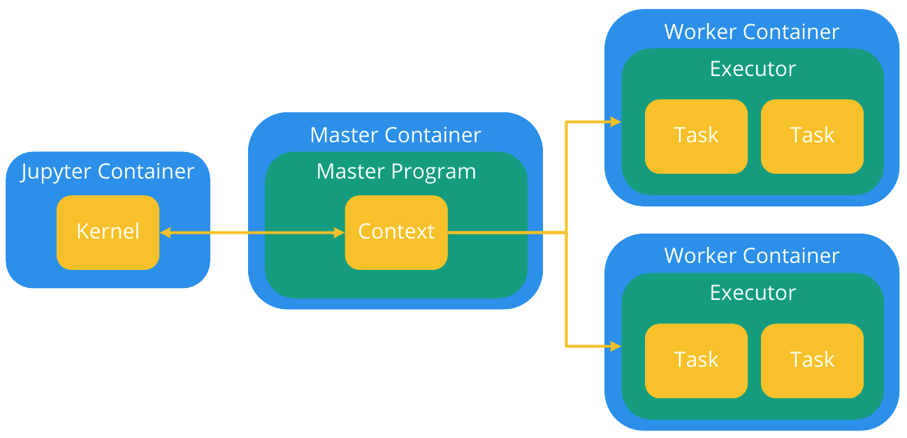
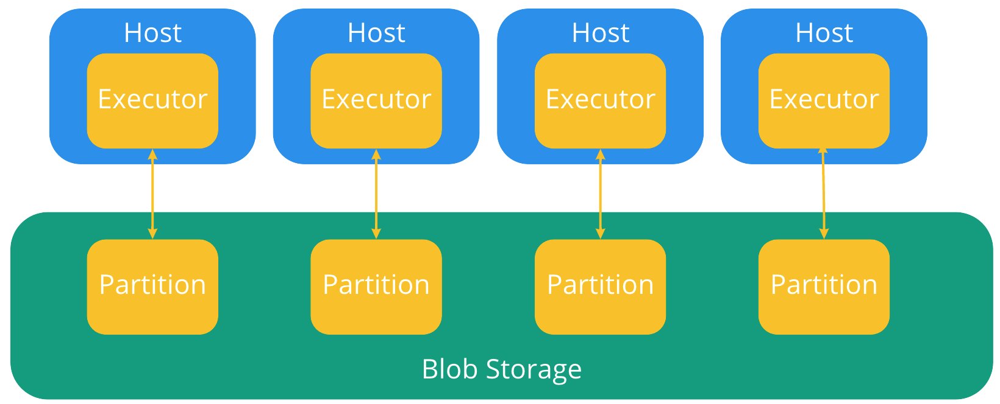
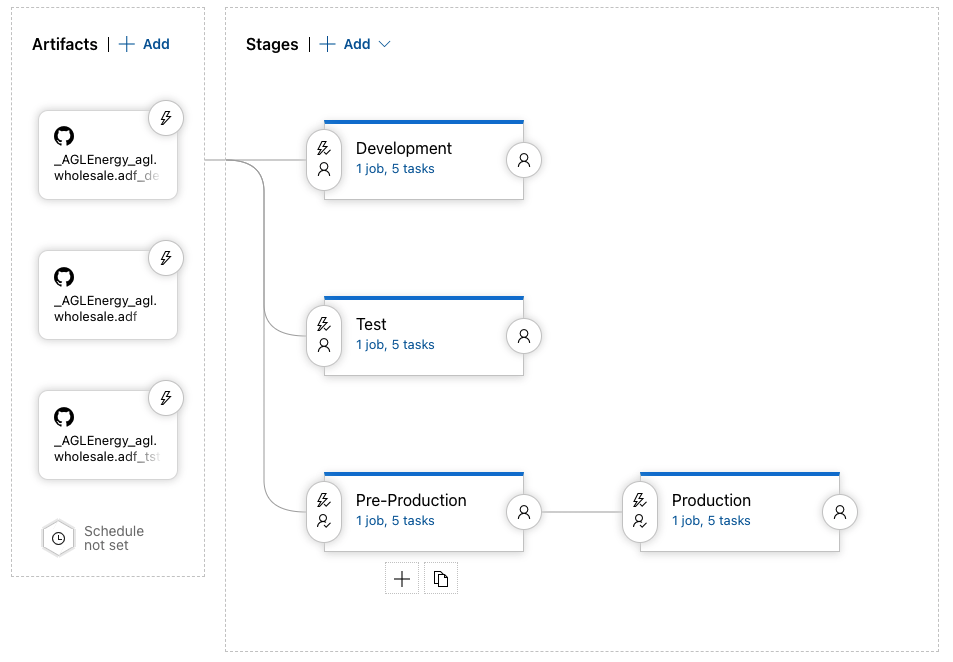

## Links
- [Spark Configuration Settings](https://spark.apache.org/docs/latest/configuration.html)
- [MarketDB ADF Source](https://github.com/AGLEnergy/agl.wholesale.adf)
- [MarketDB ADF Release](https://dev.azure.com/aglenergydev/AGL%20Wholesale%20Markets/_releaseDefinition?definitionId=139&)
- [Create Secret Scope Link](https://adb-8336486033410833.13.azuredatabricks.net/?o=8336486033410833#secrets/createScope)
- [Example Notebook](https://adb-8336486033410833.13.azuredatabricks.net/?o=8336486033410833#notebook/4238044281923967/command/277152384750583)

